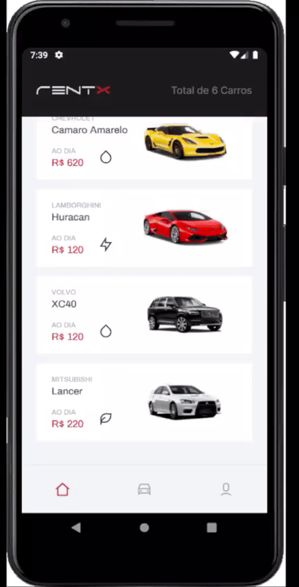
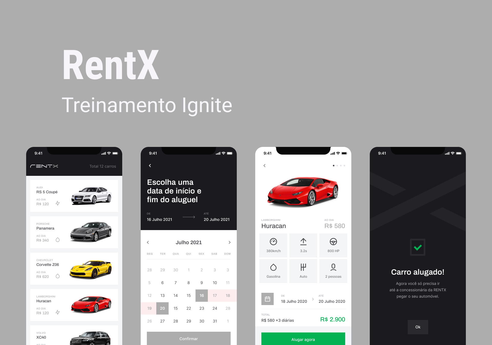

<h1 align="center">
  RentX
    <br>
    <br>
     <p align="center" >
     
    
     
  </p>

</h1>

<div align="center">
    
    <a href="https://www.linkedin.com/in/whuanderson-de-sousa-porto-marinho-a07204216//" target="_blank" rel="Whuanderson">
      
    </a>
    
  </div>
  
  
  

 <p align="center">
  :rocket: Aplicativo de aluguel de carros conectado a uma API. Feito no Ignite da @Rocketseat
 </p>
 
 <div align="center">
  <sub>O Projeto. Feito por :
    <a href="https://github.com/Whuanderson">Whuanderson Marinho</a>
  </sub>
</div>

# :hammer_and_wrench: Características 

* Cria e salva contas na API;
* Pode atualizar o perfil dentro do app;
* mostra caracteristicas dos carros;
* Permite realizar o agendamento de carros;
* Permite escolher a data do agendamento;
* Permite a vizualização de carros mesmo offline;
* Possue descrição dos carros;
* Disponibiliza a função de Logout.

# 🚀 Tecnologias

* React Native
* Typescript
* Expo
* Async Storage
* Expo Google Fonts
* React Navigation Stack
* React Native Gesture Handler

# 📱  Instalando 

*Clone o projeto e acesse a pasta*

```bash
$ git clone https://github.com/Whuanderson/rentx-ignit-complet-rocket-seat
```

# Executando o projeto

Utilize o **yarn** ou o **npm install** para instalar as dependências do projeto.
Em seguida, inicie o projeto. 

```cl
yarn start
```

Lembre-se para funcionar precisa estar conectado a uma API.

# :closed_book: Licença

Lançado em 2021 :closed_book: Licença

Feito por [Whuanderson Marinho](https://github.com/Whuanderson) 🚀.
Esse projeto está sobre [MIT license](./LICENSE).
